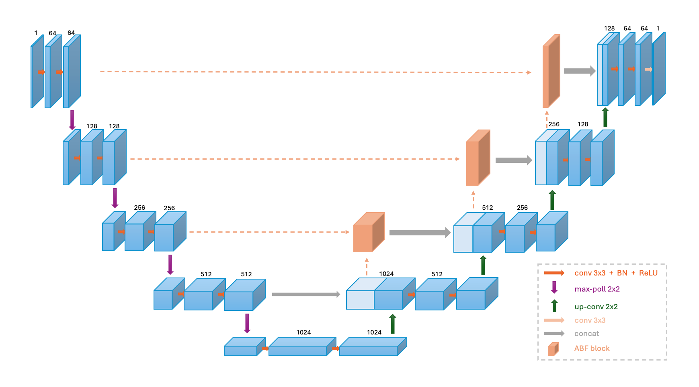

# MixFormer-UNet



MixFormer-Unet 基于经典的 U-Net 架构，改进了跳跃连接，并融入了 Transformer 结构以及基于注意力的融合 (ABF) 模块，以实现深层和浅层特征的有效融合。

MixFormer-Unet 基于 nnUNet 框架进行训练。我们对 nnUNet 框架进行了修改，以支持任意端到端医学影像分割模型进行训练和测试。

## 安装nnUNet框架

在 MixFormer-UNet 的根目录下运行该命令：

```bash
cd nnUNet
pip install -e .
```

在home目录下按ctrl + h，显示隐藏文件，找到.bashrc文件打开，在文档末尾添加下面三行（**需要更改/MixFormer_UNet之前的路径**）：

```bash
export nnUNet_raw_data_base="/MixFormer_UNet/Frame/DATASET/nnUNet_raw"
export nnUNet_preprocessed="/MixFormer_UNet/Frame/DATASET/nnUNet_preprocessed"
export RESULTS_FOLDER="/MixFormer_UNet/Frame/DATASET/nnUNet_trained_models"
```

保存文件，在home下打开终端，输入`source .bashrc`来更新该文档

## 数据集准备

MixFormer_UNet 使用的训练和测试数据集为 LiTS17，数据集官网：[CodaLab - Competition](https://competitions.codalab.org/competitions/17094)

下载数据集后，需要将数据集整理成如下格式：

```
Task01_LiTS17/
├── dataset.json
├── imagesTr
│ 	├── case_00000.nii.gz
│   ├── case_00001.nii.gz
│   ├── ...(所有训练集图像)
├── imagesTs
│ 	├── case_00013.nii.gz
│   ├── case_00014.nii.gz
│   ├── ...(所有测试集图像)
├── labelsTr
│ 	├── case_00000.nii.gz
│   ├── case_00001.nii.gz
│   ├── ...(所有训练集标签)
└── labelsTs
		├── case_00013.nii.gz
    ├── case_00014.nii.gz
    ├── ...(所有测试集标签)
```

`dataset.json`文件用于存储训练数据信息和任务信息，详见`/MixFormer_UNet/Frame/DATASET/nnUNet_raw/nnUNet_raw_data/Task01_LiTS17/dataset.json`

整理完成后，将 Task01_LiTS17 文件夹移动到`/MixFormer_UNet/Frame/DATASET/nnUNet_raw/nnUNet_raw_data`文件夹内。

**运行数据集转换的命令：**

```bash
nnUNet_convert_decathlon_task -i /MixFormer_UNet/Frame/DATASET/nnUNet_raw/nnUNet_raw_data/Task01_LiTS17
```

转换操作完成以后，在 Task01_LiTS17 文件夹同级目录，会生成一个 Task001_LiTS17 文件夹。

## 数据预处理

执行命令：
```bash
nnUNet_plan_and_preprocess -t 1 --verify_dataset_integrity
```

预处理后的数据集会输出在`nnUNet_preprocessed/Task001_LiTS17`中。

nnUNet 的 3D 医学影像分割的通用预处理可以分为四步，分别是数据格式的转换，裁剪crop，重采样resample以及标准化normalization。

## 模型训练

在`/MixFormer_UNet/nnUNet/nnunet/training/network_training/nnUNetTrainerV2.py`文件的第 58 行可以修改训练的epoch。

执行如下命令进行训练：

```bash
nnUNet_train 3d_fullres nnUNetTrainerV2 1 0 --npz
```

训练后的模型会储存在`/MixFormer_UNet/Frame/nnUNet_trained_models/nnUNet`中。

## 推理

执行如下命令进行推理：

```bash
nnUNet_predict -i 要预测数据的文件夹路径 -o 输出文件夹路径 -t 1 -m 3d_fullres -f 0
```

使用如下命令评估推理结果：

```bash
nnUNet_evaluate_folder -ref 标签文件夹 -pred 推理结果文件夹 -l 1 2 3
```

## 修改模型进行训练

在`/MixFormer_UNet/nnUNet/nnunet/network_architecture/myNet`中创建`yourModel.py`文件，文件内容如下：

```python
from nnunet.network_architecture.neural_network import SegmentationNetwork as SN
from torch import nn
model_patch_size = [32,128,128]  # 设置patch size
model_batch_size = 12  					 # 设置batch size
model_num_pool_op_kernel_sizes = [[2, 2]]
class custom_net(SN):
    def __init__(self, num_classes):
        super(custom_net, self).__init__()
        self.params = {'content': None}
        self.conv_op = nn.Conv3d
        self.do_ds = False
        self.num_classes = num_classes
        self.model = yourModel(1, num_classes) # 设置为需要训练的模型
        self.name = "yourModel"  # 设置网络名称
    def forward(self, x):
        x = x.permute(0, 1, 3, 4, 2)
        out = self.model(x)
        out = out.permute(0, 1, 4, 2, 3)
        if self.do_ds:
            return [out, ]
        else:
            return out

def create_model():
    return custom_net(num_classes=3)
  
class yourModel(nn.Module):  # 要训练的模型架构
  	...
```

并在`/MixFormer_UNet/nnUNet/nnunet/training/network_training/nnUNetTrainerV2.py`文件的第 39 行修改为：

```python
from nnunet.network_architecture.myNet.yourModel import create_model, model_patch_size, model_batch_size, model_num_pool_op_kernel_sizes
```

即可使用任意模型进行训练，训练方法与上文一致。